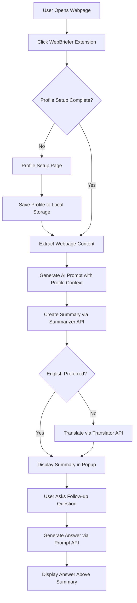

# WebBriefer - Product Requirements Document

## 1. Product Overview

WebBriefer is an intelligent Chrome extension that transforms complex web content into personalized, accessible summaries using Chrome's built-in AI capabilities. The extension analyzes webpage content and images, then generates tailored summaries based on the user's age, occupation, and language preferences, making information consumption more efficient and inclusive.

The extension addresses the challenge of information overload by providing context-aware summaries that adapt to different user backgrounds - from students to professionals - ensuring content is always presented at an appropriate comprehension level and in the user's preferred language.

## 2. Core Features

### 2.1 User Roles

| Role           | Registration Method | Core Permissions                                                          |
| -------------- | ------------------- | ------------------------------------------------------------------------- |
| Extension User | Local profile setup | Can set personal preferences, generate summaries, ask follow-up questions |

### 2.2 Feature Module

Our WebBriefer extension consists of the following main components:

1. **Profile Setup Page**: User profile configuration, preference settings, language selection.
2. **Extension Popup**: Summary display, follow-up question interface, settings access.
3. **Content Analysis Engine**: Webpage content extraction, image processing, context preparation.
4. **AI Integration Layer**: Prompt generation, summarization, translation, Q\&A processing.

### 2.3 Page Details

| Page Name               | Module Name         | Feature description                                                                                                                         |
| ----------------------- | ------------------- | ------------------------------------------------------------------------------------------------------------------------------------------- |
| Profile Setup Page      | User Profile Form   | Collect and store user age, gender, country, highest education level, role/occupation, preferred language with validation and local storage |
| Profile Setup Page      | Language Selector   | Dropdown menu with 20+ language options for summary translation preferences                                                                 |
| Extension Popup         | Summary Display     | Show personalized webpage summary with loading states and error handling                                                                    |
| Extension Popup         | Follow-up Q\&A      | Text input field and submit button for asking questions about the summarized content                                                        |
| Extension Popup         | Settings Access     | Quick access to profile editing and extension preferences                                                                                   |
| Content Analysis Engine | Webpage Reader      | Extract text content, headings, and metadata from current webpage using content scripts                                                     |
| Content Analysis Engine | Image Processor     | Capture and analyze images on webpage for multimodal AI processing                                                                          |
| AI Integration Layer    | Prompt Generator    | Create contextual prompts combining user profile, webpage content, and images for Gemini Nano                                               |
| AI Integration Layer    | Summary Engine      | Generate 500-word summaries using Summarizer API with user-appropriate language complexity                                                  |
| AI Integration Layer    | Translation Service | Translate summaries to user's preferred language using Translator API                                                                       |
| AI Integration Layer    | Q\&A Handler        | Process follow-up questions using summary and original content as context via Prompt API                                                    |

## 3. Core Process

**Main User Flow:**

1. User installs extension and sets up profile (age, occupation, preferred language, country, highest education level, country)
2. User navigates to any webpage and clicks the WebBriefer extension icon
3. Extension extracts webpage content and images automatically
4. AI generates a personalized prompt based on user profile and content
5. Summarizer API creates a 500-word summary tailored to user's comprehension level
6. If needed, Translator API converts summary to user's preferred language
7. Summary displays in popup with option to ask follow-up questions
8. User can input questions and receive contextual answers based on the content

## 4. User Interface Design

### 4.1 Design Style

* **Primary Colors**: Chrome blue (#4285F4) and clean white (#FFFFFF)

* **Secondary Colors**: Light gray (#F8F9FA) for backgrounds, dark gray (#5F6368) for text

* **Button Style**: Rounded corners (8px radius) with subtle shadows and hover effects

* **Font**: System fonts (Roboto on Chrome OS, San Francisco on macOS, Segoe UI on Windows)

* **Font Sizes**: 16px for body text, 14px for secondary text, 18px for headings

* **Layout Style**: Card-based design with clean spacing and minimal visual clutter

* **Icons**: Material Design icons for consistency with Chrome ecosystem

### 4.2 Page Design Overview

| Page Name          | Module Name       | UI Elements                                                                                                        |
| ------------------ | ----------------- | ------------------------------------------------------------------------------------------------------------------ |
| Profile Setup Page | User Profile Form | Clean form layout with labeled input fields, age slider (8-100), occupation dropdown, language selector with flags |
| Profile Setup Page | Save Button       | Primary blue button with "Save Profile" text, full-width design with loading state                                 |
| Extension Popup    | Header            | WebBriefer logo, settings gear icon, current webpage title truncated to 40 characters                              |
| Extension Popup    | Summary Display   | Card-based layout with scrollable text area, 300px max height, loading skeleton animation                          |
| Extension Popup    | Q\&A Section      | Text input with placeholder "Ask a follow-up question...", blue submit button, answer display above                |
| Extension Popup    | Footer            | Powered by Chrome AI badge, feedback link, version number                                                          |

### 4.3 Responsiveness

The extension popup is designed with a fixed width of 400px and adaptive height (300-600px) to accommodate different summary lengths. The interface is optimized for mouse and keyboard interaction, with proper focus states and accessibility features for screen readers.
