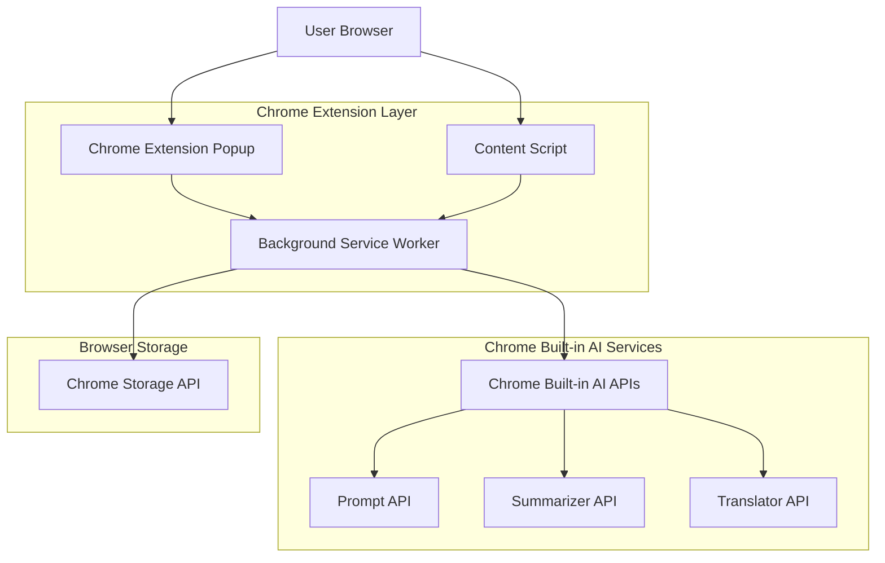
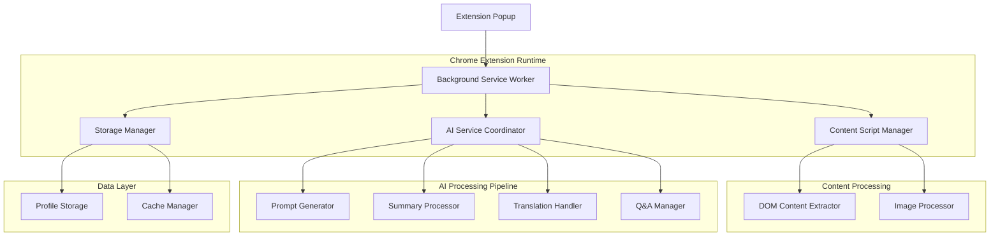
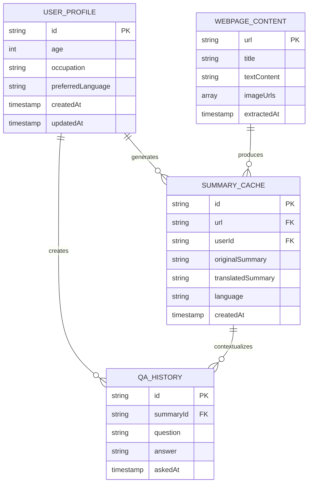

# WebBriefer - Technical Architecture Document

## 1. Architecture Design



## 2. Technology Description

- **Frontend**: Chrome Extension Manifest V3 + HTML5 + CSS3 + Vanilla JavaScript
- **AI Services**: Chrome Built-in AI APIs (Prompt API, Summarizer API, Translator API)
- **Storage**: Chrome Storage API for user profiles and preferences
- **Content Processing**: Content Scripts for webpage analysis and DOM manipulation

## 3. Route Definitions

| Route | Purpose |
|-------|---------|
| popup.html | Main extension popup interface for displaying summaries and Q&A |
| options.html | User profile setup and settings configuration page |
| content.js | Content script injected into webpages for content extraction |
| background.js | Service worker for AI API coordination and data processing |

## 4. API Definitions

### 4.1 Chrome Built-in AI APIs

**Prompt API Integration**
```javascript
// Generate contextual prompts for Gemini Nano
const session = await ai.languageModel.create({
  systemPrompt: `You are helping a ${userProfile.age}-year-old ${userProfile.occupation}...`
});
```

**Summarizer API Integration**
```javascript
// Create webpage summaries
const summarizer = await ai.summarizer.create({
  type: 'key-points',
  format: 'plain-text',
  length: 'medium'
});
```

**Translator API Integration**
```javascript
// Translate summaries to preferred language
const translator = await ai.translator.create({
  sourceLanguage: 'en',
  targetLanguage: userProfile.preferredLanguage
});
```

### 4.2 Core Extension APIs

**Content Extraction**
```javascript
// Extract webpage content and images
function extractPageContent() {
  return {
    title: document.title,
    text: document.body.innerText,
    images: Array.from(document.images).map(img => img.src),
    url: window.location.href
  };
}
```

**User Profile Management**
```javascript
// Save/retrieve user profile
chrome.storage.local.set({
  userProfile: {
    age: number,
    occupation: string,
    preferredLanguage: string
  }
});
```

## 5. Server Architecture Diagram



## 6. Data Model

### 6.1 Data Model Definition



### 6.2 Data Definition Language

**User Profile Storage (Chrome Storage API)**
```javascript
// User profile structure
const userProfile = {
  id: 'user_' + Date.now(),
  age: 25,
  occupation: 'Software Developer',
  preferredLanguage: 'es', // ISO 639-1 language code
  createdAt: new Date().toISOString(),
  updatedAt: new Date().toISOString()
};

// Save to Chrome storage
chrome.storage.local.set({ userProfile });
```

**Summary Cache Structure**
```javascript
// Summary cache for performance optimization
const summaryCache = {
  id: 'summary_' + Date.now(),
  url: 'https://example.com/article',
  userId: 'user_123',
  originalSummary: 'English summary text...',
  translatedSummary: 'Translated summary text...',
  language: 'es',
  createdAt: new Date().toISOString()
};

// Cache management with 24-hour expiry
chrome.storage.local.set({ 
  [`summary_${url_hash}`]: summaryCache 
});
```

**Q&A History Storage**
```javascript
// Question and answer history
const qaHistory = {
  id: 'qa_' + Date.now(),
  summaryId: 'summary_123',
  question: 'What are the main benefits mentioned?',
  answer: 'The main benefits include...',
  askedAt: new Date().toISOString()
};

// Store Q&A pairs for context
chrome.storage.local.set({ 
  [`qa_${summaryId}`]: qaHistory 
});
```

**Manifest V3 Configuration**
```json
{
  "manifest_version": 3,
  "name": "WebBriefer",
  "version": "1.0.0",
  "permissions": [
    "activeTab",
    "storage",
    "aiLanguageModelOriginTrial",
    "aiSummarizerOriginTrial",
    "aiTranslatorOriginTrial"
  ],
  "background": {
    "service_worker": "background.js"
  },
  "content_scripts": [{
    "matches": ["<all_urls>"],
    "js": ["content.js"]
  }],
  "action": {
    "default_popup": "popup.html"
  }
}
```